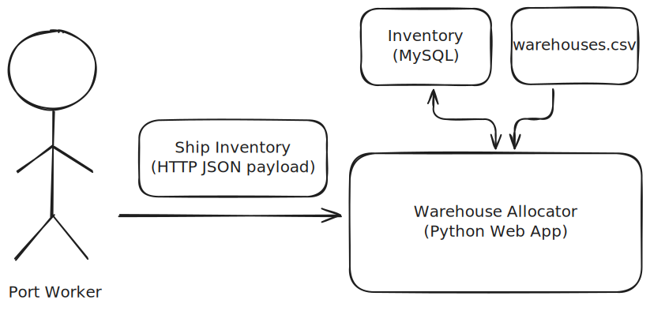

+++ 
draft = false
date = 2025-12-31
title = "Build Your Program, Then Run It"
+++

We ultimately write software because people have a need for it. Those needs change over time in unpredictable ways.
Since we can't afford (in time or money terms) to rewrite the whole thing each time those needs change, we write new
code which works with old code to do new stuff. This isn't always done gracefully; every project I've ever worked on has
some amount of 'spaghetti' code which is challenging to work with in some way.

Over time, I've developed a coding style which has helped me write new code and refactor existing code in a way that
enables future developers to more easily and intentionally evolve the codebase. I like to think of this style as 'build
it, then run it', where a program is split into two steps; construction (of objects at runtime) and execution of that
construction. I'm sharing it here in case it might be useful to you!

Treat this more as a set of guidelines rather than hard rules. Be pragmatic when applying them, as going to the extreme
can be just as unwieldy.

I'm giving examples here in Python, but it extends to any other OO language (a lot of it is just observations from good
Rust code!), and the gist should be applicable in any programming language.

## Perfect Code
I think that the perfect chunk of code has these characteristics:

- **Intentional**. The code is mapped to a single clear business or technical purpose. It isn't polluted with multiple
  ideas or weird edge case handling.
- **Testable**. It is straightforward to write reliable automated tests for. These tests can cover edge cases without
  doing weird things like patching over dependencies.
- **Reusable**. Where applicable, code should be thought of as 'building blocks', with those blocks being shareable
  within the project and by other projects.
- **Incremental**. The 'building blocks' can be understood at any level of abstraction, without needing to understand
  how they are being used or how they are implemented.
- **Empathetic**. The developer thought about how it might evolve in the future, leaving behind 'hooks' to make that
  evolution easier.

## My Patterns
I see most code as being refactorable into these four patterns:

- Data: immutable state.
- Handlers: takes some data, does a single logical thing to it (sometimes involving I/O), and returns new data.
- Flows: glues together multiple handlers into a larger chunk of business logic.
- Contexts: mutable state.

Now let's work through an example problem, refactoring it in through the lens of these patterns.

## Today's Problem - Shipping Logistics
We've been tasked to help a shipping port company. They struggle to use their warehouses efficiently to temporarily
store commodities being shipped in before they are transported inland.


They have an existing Python script which does this work. They're happy with the deployment architecture but are finding
it difficult to extend the solution to new requirements.


The architecture involves three CSV files:

- `warehouses.csv`: the storage space available, per commodity type, in each warehouse.
- `inventory.csv`: the current inventory of the port and which warehouse it is stored in.
- `ship_inventory.csv`: the inventory of the ship that has just arrived into the port.

The warehouse allocator's job is to take the `ship_inventory.csv` and update `inventory.csv` with it, given
the capacity constraints listed in `warehouses.csv`. A particular area of caution is that capacity constraints
for each commodity are denominated in a different unit (for example, oil is measured in standard litres but corn is
measured in a 56 lb bushel).

We can immediately spot potential requirements which may change in the future, which will need our solution to be
flexible there:

- The CSV files could (independently) be migrated to other storage types (e.g. a RDBMS like MySQL, a NoSQL database like
  MongoDB, etc.).
- New commodity types are added.
- New units are added, possibly for existing commodity types.

Let's break this refactoring down into my patterns, visiting parts of the codebase and improving them.

### Data
My 'data' pattern is all about modelling reality. I find that having the right base models to operate on makes it 
easier to reason about the program's logic and avoid problems when evolving the logic later. Making them immutable
also makes it much easier to mentally track.

We'll look at how the `warehouses.csv` file is handled in the existing program. It has this structure:

| warehouse_id | commodity_type | capacity |
|--------------|----------------|----------|
| 1            | CORN           | 10,000   |
| 1            | OIL            | 500      |

It reads from the CSV file using Python's `DictReader`.

```python
with open("warehouses.csv", "r") as f:
    warehouse_capacities = list(DictReader(f))
```

That's about it. All the functions in the codebase accept a `dict` for each warehouse capacity record, which looks like
this:

```python
{"warehouse_id": "1", "commodity_type": "CORN", "capacity": "10000"}
```

On a small scale, this is fine. But when many dictionaries are in scope (from the other CSVs) and there is no clear way
to know what is inside, it becomes hard to reason about the code. Not to mention that there can be all sorts of data
issues that downstream code will need to deal with (in this example, `capacity` is a `str` that needs to be converted
to an `int`).

Instead, we can model this using strongly typed data classes. These are just plain Python objects. I think it's 
worthwhile putting a lot of effort into moving the invariants of the reality into the type system. There are a few of
these to focus on in the problem:

- A warehouse has an id and can store a certain quantity of different commodities. We'll call these 'capacity units'.
- The amount is measured in different units depending on the commodity (e.g. oil is currently measured in standard
  litres). We really don't want to mix these up.
- There's a known list of commodities and the units that the port currently denominates them in.
- Two commodities could be measured in the same unit.
- A commodity could be measured in a different unit in the future (e.g. oil could be measured in metric tons).


```python
class Commodity(str, Enum):
    CORN = "CORN"
    OIL = "OIL"


class Amount(ABC):
    pass


@dataclass(frozen=True)
class StandardLitre(Amount):
    amount: int


@dataclass(frozen=True)
class CornBushel(Amount):
    amount: int


@dataclass(frozen=True)
class WarehouseCapacityUnit:
    commodity: Commodity
    amount: Amount


@dataclass(frozen=True)
class Warehouse:
    id: int
    capacities: list[WarehouseCapacityUnit]
```

Data objects should encompass **only** data, without behaviour or opinion about how it is used. Some simple methods and
properties which present the underlying data differently are acceptable if they are general enough.

I also like adding `from_*` methods to data objects when they can be constructed from another object, in the style of
[Rust's From trait](https://doc.rust-lang.org/std/convert/trait.From.html). I'll demonstrate that with a `StandardLitre`
here, although it is identical to the constructor in this case:

```python
@dataclass(frozen=True)
class StandardLitre(Amount):
    amount: int

    @classmethod
    def from_amount(cls, amount: int) -> Self:
        return cls(amount)
```

Creating the same warehouse in Python code is now strongly-typed and looks like this:

```python
Warehouse(
    id=1,
    capacities=[
        WarehouseCapacityUnit(commodity=Commodity.CORN, amount=CornBushel(10_000)),
        WarehouseCapacityUnit(commodity=Commodity.OIL, amount=StandardLitre(500)),
    ],
)
```

It's now clearer what all the pieces are; a function with an input of type `Warehouse` can now be more easily understood
than one with type `dict`.

We still have the problem that we need to map from the CSV into this format, which is a great time to introduce 
'handlers'.

### Handlers
We now have data represented via data objects, but we have to do _things_ with them. 'Handlers' are where that logic
lives.

A handler has these components:

- An interface (usually of a single method).
- Arguments which configure the behaviour of the handler.
- Arguments to the handler, returning an output.

For parsing warehouses from CSV, we want a single handler, `CSVWarehouseParser`, with a `parse_warehouse` method:

```python
class WarehouseParser(ABC):
    @abstractmethod
    def parse_warehouses(self) -> list[Warehouse]: ...


@dataclass
class CSVWarehouseParser(WarehouseParser):
    file: Path

    def parse_warehouses(self) -> list[Warehouse]:
        warehouses = []
        csv_file_path = self.file.resolve(strict=True)

        with open(csv_file_path, "r") as f:
            reader = DictReader(f)
            # implementation elided

        return warehouses
```

You might think this is a lot of boilerplate for what could be a single function, but it does come with one thing that
makes it very powerful: _flexibility_. As long as we depend on `WarehouseParser` in our program, we can swap out the
implementation from `CSVWarehouseParser` to a parser that, for example, reads from a MySQL database, without changing
the rest of the program. We also keep object construction separate and explicit (it isn't part of the parser interface,
which I've always found hard to abstract over). The flexibility will be useful when we visit 'flows'.

To note, the full implementation doesn't have to exist within the `parse_warehouse` method - it could call any number of
private functions. But this method should be the only entrypoint to that logic.

A simple use of this parser looks like this:

```python
parser = CSVWarehouseParser(Path("warehouses.csv"))
warehouses = parser.parse_warehouses()
```

We'll also have handlers for parsing the current inventory and ship inventory CSVs, which are similar. A more
interesting handler to show would be the `Allocator`, which allocates the ship's inventory into the most appropriate
warehouse. We'll first implement a naive one which just chooses the first available warehouse, filling it up to a 
threshold if possible.

```python
class Allocator(ABC):
    @abstractmethod
    def allocate(
        self,
        warehouses: list[Warehouse],
        inventory: Inventory,
        ship_inventory: ShipInventory,
    ) -> Inventory: ...


@dataclass
class FirstAvailableAllocator(Allocator):
    ideal_threshold: float

    def allocate(
        self,
        warehouses: list[Warehouse],
        inventory: Inventory,
        ship_inventory: ShipInventory,
    ) -> Inventory:
        return Inventory()  # implementation elided...
```

We could then create a configuration of this handler that tries to allocate up to 90%.

```python
allocator = FirstAvailableAllocator(ideal_threshold=0.9)
```

We might later decide that we wanted to replace this algorithm with one that distributes the load equally across all
warehouses.

```python
@dataclass
class EqualDistributionAllocator(Allocator):
    def allocate(
        self,
        warehouses: list[Warehouse],
        inventory: Inventory,
        ship_inventory: ShipInventory,
    ) -> Inventory:
        return Inventory()  # implementation elided...
```

Again, we can just swap this into the place of a `FirstAvailableAllocator` without changing any implementation, as long
as downstream code only codes against the `Allocator` interface.

Let's tie these handlers together with a flow!

### Flows
A 'flow' runs handlers sequentially. It only depends on the abstract form of the handler, not a specific implementation,
which allows the behaviour to be swapped out easily.


Any flow code which does more than basic data manipulation or error handling should probably be extracted into its
own handler. Branching is a good indicator of this.

Recall that the problem we're trying to solve is made up of these parts:

- Parse the warehouse, inventory, and ship inventory inputs.
- Feed them into the allocator to get back an optimal allocation.
- Store those results.

I've added handlers for parsing the other file types we haven't seen yet and one for storing the results. Given these
handlers, it's really easy to write the flow:

```python
@dataclass
class NewInventoryAllocationFlow:
    warehouse_parser: WarehouseParser
    inventory_parser: InventoryParser
    ship_inventory_parser: ShipInventoryParser
    allocator: Allocator
    inventory_storer: InventoryStorer

    def allocate_new_inventory(self) -> None:
        warehouses = self.warehouse_parser.parse_warehouses()
        current_inventory = self.inventory_parser.parse_inventory()
        ship_inventory = self.ship_inventory_parser.parse_ship_inventory()

        new_inventory = self.allocator.allocate(
            warehouses=warehouses,
            inventory=current_inventory,
            ship_inventory=ship_inventory,
        )

        self.inventory_storer.store_inventory(new_inventory)
```

I hope you can see that it reads just like the business logic!

We can then create and run this flow with our CSV parsers and storers, using a simplistic allocator:

```python
flow = NewInventoryAllocationFlow(
    warehouse_parser=CSVWarehouseParser(Path("./warehouses.csv")),
    inventory_parser=CSVInventoryParser(Path("./inventory.csv")),
    ship_inventory_parser=CSVShipInventoryParser(Path("./ship_inventory.csv")),
    allocator=FirstAvailableAllocator(ideal_threshold=0.9),
    inventory_storer=CSVInventoryStorer(Path("./new_inventory.csv")),
)
flow.allocate_new_inventory()
```

That's pretty much our whole program done now. All that is remaining is to wrap it in some CLI boilerplate, which I'll
skip here.

To reiterate the name of the post, the 'build it' refers to instantiating `NewInventoryAllocationFlow`, while 'run it'
refers to the `allocate_new_inventory` call.

This design is very flexible. To demonstrate this, let's say we get some sudden change in requirements:

- Migrate the service to a web server, receiving the ship inventory in JSON over HTTP.
- Use an allocation algorithm that attempts to use all warehouses equally.
- Store the current inventory in a MySQL database.



We can make each of these changes in their own handler implementations and swap them out in the flow:

```python
db_url = os.environ["DATABASE_URL"]

flow = NewInventoryAllocationFlow(
    warehouse_parser=CSVWarehouseParser(Path("./warehouses.csv")),
    inventory_parser=MySQLInventoryParser(db_url),
    ship_inventory_parser=JSONShipInventoryParser(ship_inventory_json),
    allocator=EqualDistributionAllocator(),
    inventory_storer=MySQLInventoryStorer(db_url),
)
flow.allocate_new_inventory()
```

Of course, the implementation for each handler is a real challenge, but the structure of the code hasn't
caused us any problems when migrating.

The zen moment is when you realise that the whole configuration of the program happens at the top level in a declarative
fashion. You should be able to look at the code which defines your flow and immediately understand the high-level logic
of what it is doing.

This approach has a few benefits for an engineering team:

- We could ship each requirement individually rather than in a 'big bang'.
- If we find any defects, it's much easier to roll back to the old handler.
- In a development team, we could distribute the features across developers without worrying about them conflicting (as
  much).
- If we were using feature flagging to control the rollout of the new handlers, we configure it at the top level of the
  program. Often, we have to stick `if-else` blocks deep within the code, which is hard to reason about.
- Since we have full control over the handlers used, we can configure the flow with mock objects for unit testing. This
  is especially useful when a handler performs I/O. This should still be tested in integration tests elsewhere, but
  removing it from the unit tests makes them isolated, fast, and reliable.

I particularly like that developers can work on handlers _without having to integrate them with the production code_.
They can frequently commit small and incremental changes to the handlers without the risk of the code running in
production, even if the code is continuously deployed. Small and frequent reviews are much easier to deal with for both
the authors and the reviewers.

For more complex code, the business logic might be too large for a single flow. Flows can also be configured with 
other flows to break the logic out. Consider making an interface for the flow if it would be easier to swap it out.


### Contexts
One thing that unifies data, handlers, and flows is that they are all immutable. This is powerful because we can
reuse and parallelise them without the headache.

This approach struggles if we need to keep track of metadata not directly related to the handler's job. It would be
awkward if the handler had to return two results, one for data and the other for the metadata. Sprinkle this across 
multiple handlers in the one flow, and you get a mess!

This is where a 'context' is useful. It's a simple object, just like the 'data' pattern, but it's mutable. Contexts
can be at the handler level or the flow level and are highly coupled to them.

Let's say we wanted to keep track of the parsing failures for the `warehouses.csv` file. Sometimes, workers manually
mis-input the warehouse capacity details which used to cause the program to crash. It has since been improved to skip
parsing failures, logging them when they occur. This is good, but they aren't usually watching the logs for these
errors, so the failure can sometimes be missed. We want the `WarehouseParser` handler to report these failures to the
flow, which is responsible for reporting them in some way later.

We'll first create a `ParserContext`, which tracks a list of records which failed to parse. We add a helper method,
`note_failure`, for appending to this. It's usually best to expose the mutable bits through helper methods, as direct
writes elsewhere in the program can make it confusing.

```python
@dataclass
class ParserContext:
    failed_records: list[str] = field(default_factory=list)

    def note_failure(self, record: str) -> None:
        self.failed_records.append(record)
```

We'll then have an instance of this passed into the handler's interface, editing the CSV implementation to call
`note_failure` when a record fails validation.

```python
class WarehouseParser(ABC):
    @abstractmethod
    def parse_warehouses(self, context: ParserContext) -> list[Warehouse]: ...


@dataclass
class CSVWarehouseParser(WarehouseParser):
    file: Path

    def parse_warehouses(self, context: ParserContext) -> list[Warehouse]:
        csv_file_path = self.file.resolve(strict=True)
        warehouses = []

        with open(csv_file_path, "r") as f:
            reader = DictReader(f)
            for record in reader:
              # implementation elided
              if not is_record_valid:
                  context.note_failure(record)

        return warehouses
```

This will be returned to the flow that calls this handler. We don't want to complicate things by forcing the flow to 
manage a number of contexts from all the handlers it calls, so we'll create a context for the flow itself. This context
exposes methods which extract the relevant pieces from the handler's context.

```python
@dataclass
class NewInventoryAllocationContext:
    warehouse_parsing_failures: list[str] = field(default_factory=list)

    def add_warehouse_parsing_context(self, context: ParserContext) -> None:
        self.warehouse_parsing_failures.extend(context.failed_records)
```

The start of our flow can now be edited with a little boilerplate to keep track of the contexts. Note that a flow
typically creates and manages its own context, while handlers have them passed in and just mutate them.

```python
def allocate_new_inventory(self) -> None:
    context = NewInventoryAllocationContext()

    warehouse_parsing_context = ParserContext()
    warehouses = self.warehouse_parser.parse_warehouses(context=warehouse_parsing_context)
    context.add_warehouse_parsing_context(context=warehouse_parsing_context)
    # ...
```

## Conclusion
That's everything! I find that I can write most programs using this approach and not hate changing what it does later.

In short, dependency injection is great (I somehow got this far without mentioning it!). Don't be scared of creating
new classes. Keep your code in a 'tree' structure, avoid complex dependency graphs. Prefer immutability when possible.
Design with flexibility in mind from the start.
